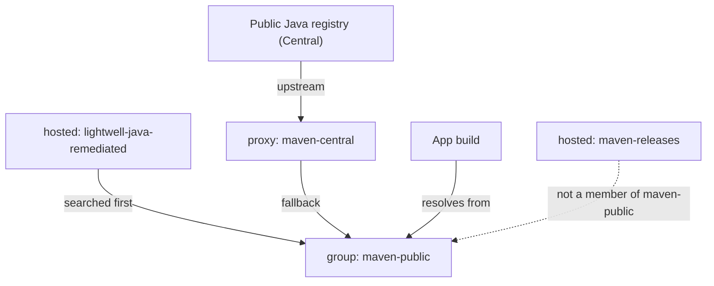
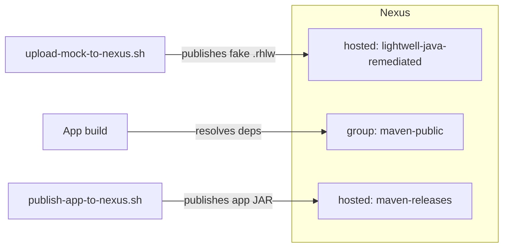
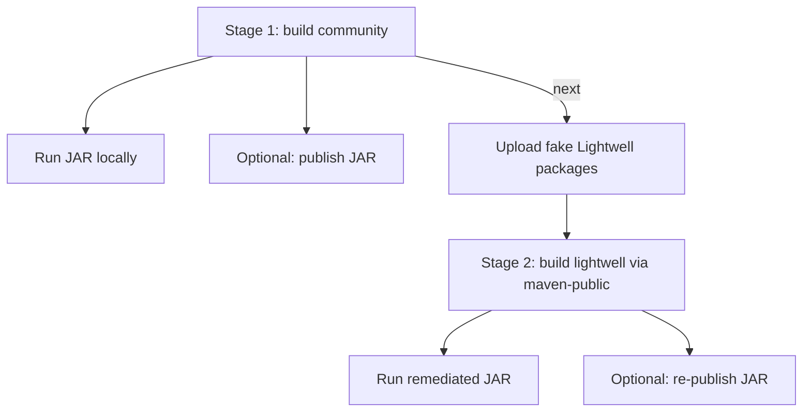
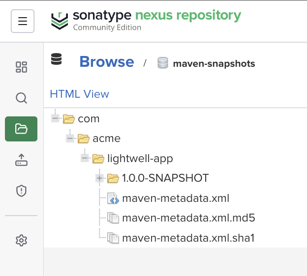

# lightwell_app

**ACME Order Hub** — demo for [Red Hat Lightwell Network](https://www.redhat.com/en/technologies/cloud/lightwell-network). Show a normal Spring Boot build first, then Stage 2: resolve a **fake Lightwell** Spring version (`5.3.18.rhlw-00010`) through **Sonatype Nexus**.

## Table of contents

1. [Prerequisites](#prerequisites)
2. [How the pieces fit](#how-the-pieces-fit)
3. [Repositories (match shared Nexus)](#repositories-match-shared-nexus)
4. [Demo story (vulnerable → production-ready)](#demo-story-vulnerable--production-ready)
5. [Stage 1 — Build the app normally](#stage-1--build-the-app-normally)
6. [Already have Nexus?](#already-have-nexus)
7. [Stage 2 — Lightwell through Nexus (fake package)](#stage-2--lightwell-through-nexus-fake-package)
8. [Optional: provision Nexus with Ansible](#optional-provision-nexus-with-ansible)
9. [Story library](#story-library)
10. [Docs](#docs)

## Prerequisites

| Need | Stage 1 | Stage 2 / publish |
|------|---------|-------------------|
| JDK 11 | yes | yes |
| Project build wrapper (`./mvnw`) | yes | yes |
| Sonatype Nexus (existing or Ansible) | no | yes |
| Nexus admin password | no | yes |

## How the pieces fit

**Nexus layout** — how dependency resolution is wired. App publish uses stock `maven-releases` (not a member of `maven-public`).



**How packages and the app JAR move** — same Nexus; three different paths:



**Demo flow** — do Stage 1, then Stage 2; publish is optional either time:



Use the **stock** Nexus names (`maven-central`, `maven-public`, `maven-releases`) plus the shared **`lightwell-java-remediated`** hosted repo — no duplicate `central` / `public` / `acme-releases` repos.

## Repositories (match shared Nexus)

These usually **already exist**. Do not create second copies with different names.

| Name | Type | On shared Nexus | What you do |
|------|------|-----------------|-------------|
| `maven-central` | **proxy** | stock default | Leave as-is (remote = Central) |
| `lightwell-java-remediated` | **hosted** | colleague / Lightwell | Bucket for `.rhlw` Spring packages — the repo can exist and still be empty until you upload |
| `maven-snapshots` | **hosted** | stock default | SNAPSHOT builds published here by `publish-app-to-nexus.sh` (auto-selected) |
| `maven-releases` | **hosted** | stock default | Release builds published here by `publish-app-to-nexus.sh` (auto-selected) |
| `maven-public` | **group** | stock default | **Edit members** so order is: (1) `lightwell-java-remediated`, (2) `maven-central` (keep other members after if you want) |

Ignore unrelated defaults (`nuget-*`, `pypi-*`, `maven-snapshots`, `maven-all`, etc.) for this Java demo.

Then follow the command blocks in [Already have Nexus?](#already-have-nexus) and [Stage 2](#stage-2--lightwell-through-nexus-fake-package).

## Demo story (vulnerable → production-ready)

Simple arc: same Order Hub app, same Spring version line — community pin is **vulnerable**, Lightwell pin via Nexus is **production-ready**. No app code rewrite.

| Beat | Spring version | Demo CVE catalog |
|------|----------------|------------------|
| **Stage 1** (community) | `5.3.18` | VULNERABLE |
| **Stage 2** (Lightwell via Nexus) | `5.3.18.rhlw-00010` | REMEDIATED |

`./scripts/cve-status.sh` is **not a scanner**. It prints a hardcoded Spring CVE catalog (same idea as the UI). The CVE **IDs are real**; the VULNERABLE / REMEDIATED labels flip only when the Spring version contains `rhlw`.

### Spring CVEs in this demo

| CVE | One-line context | Read more |
|-----|------------------|-----------|
| [CVE-2022-22965](https://nvd.nist.gov/vuln/detail/CVE-2022-22965) | “Spring4Shell” — RCE class of issue in Spring MVC on certain setups | [NVD](https://nvd.nist.gov/vuln/detail/CVE-2022-22965) · [Spring](https://spring.io/security/cve-2022-22965) |
| [CVE-2023-20860](https://nvd.nist.gov/vuln/detail/CVE-2023-20860) | Security bypass via pattern mismatch (Spring Security / MVC) | [NVD](https://nvd.nist.gov/vuln/detail/CVE-2023-20860) · [Spring](https://spring.io/security/cve-2023-20860) |
| [CVE-2023-20863](https://nvd.nist.gov/vuln/detail/CVE-2023-20863) | Spring Expression DoS / resource issues on affected 5.3.x lines | [NVD](https://nvd.nist.gov/vuln/detail/CVE-2023-20863) · [Spring](https://spring.io/security/cve-2023-20863) |

### Optional: `cve-status.sh` — expected output

**Before** (vulnerable):

```bash
./scripts/cve-status.sh community
```

```text
=== ACME Order Hub — Spring remediation demo ===
Profile: community (community)
Spring Framework: 5.3.18

Demo CVE catalog (not a scanner):
  CVE-2022-22965       Spring Framework       VULNERABLE
  CVE-2023-20860       Spring Framework       VULNERABLE
  CVE-2023-20863       Spring Framework       VULNERABLE
```

**After** (production-ready):

```bash
./scripts/cve-status.sh lightwell
```

```text
=== ACME Order Hub — Spring remediation demo ===
Profile: lightwell (lightwell-remediated)
Spring Framework: 5.3.18.rhlw-00010

Demo CVE catalog (not a scanner):
  CVE-2022-22965       Spring Framework       REMEDIATED
  CVE-2023-20860       Spring Framework       REMEDIATED
  CVE-2023-20863       Spring Framework       REMEDIATED
```

## Stage 1 — Build the app normally

Community Spring Framework `5.3.18` from public Central. No Nexus required.

**1. Build the application**

```bash
./mvnw -Pcommunity package
```

`./mvnw` is the project build wrapper (downloads the build tool if needed — you do not install anything globally).  
`-Pcommunity` selects the **community** profile in `pom.xml` (Spring Framework pinned to `5.3.18`).  
`package` compiles the app and produces a runnable JAR at `target/lightwell-app-1.0.0-SNAPSHOT.jar`.

**2. Run the application**

```bash
java -jar target/lightwell-app-1.0.0-SNAPSHOT.jar
```

Starts the Spring Boot server using that JAR (needs JDK 11+). Leave this terminal running; open http://localhost:8080 for the demo console (same before/after CVE story as the optional script). Stop with Ctrl+C when finished.

Optional talk-track printout: `./scripts/cve-status.sh community`

## Already have Nexus?

Use this path when Nexus is already running. You do **not** need Ansible provisioning.

Confirm the [Repositories](#repositories-match-shared-nexus) table (especially `maven-public` member order), then continue below.

### A. Publish the app JAR into Nexus

```bash
./mvnw -Pcommunity package

export NEXUS_URL='http://<your-nexus-host>:8081'
export NEXUS_USER='admin'
export NEXUS_PASSWORD='...'
./scripts/publish-app-to-nexus.sh
```

The script auto-selects the right Nexus repo: `maven-snapshots` for `-SNAPSHOT` versions, `maven-releases` for release versions. Override with `NEXUS_REPO` if needed.

Browse: `http://<nexus-host>:8081` → **Browse** → `maven-snapshots` → `com/acme/lightwell-app`:



### B. Point builds at Nexus (required before Stage 2; optional for Stage 1)

Maven does **not** use `NEXUS_*` env vars. Create a local settings file (gitignored) so builds resolve through Nexus:

```bash
cp maven/settings-nexus.xml.example maven/settings-nexus.xml
```

Edit `maven/settings-nexus.xml`:

1. Set both `<url>` values to `http://<nexus-host>:8081/repository/maven-public/`
2. Set `<password>` to your Nexus admin (or deploy user) password

Optional Stage 1 check (resolve community deps via Nexus):

```bash
./mvnw -Pcommunity -s maven/settings-nexus.xml package
```

## Stage 2 — Lightwell through Nexus (fake package)

Demo simulation: same idea as real Lightwell, without `packages.redhat.com`.

**Two different things (easy to confuse):**

| Thing | What it is |
|-------|------------|
| `lightwell-java-remediated` on Nexus | An empty (or already-filled) **bucket** — a place to store artifacts. Having this repo does **not** mean Stage 2 packages are present. |
| `build-mock-lightwell-repo.sh` | Builds the **fake Lightwell packages** on your laptop (does **not** create the Nexus repo). |
| `upload-mock-to-nexus.sh` | Pushes those packages **into** the Nexus bucket. |

What `build-mock-lightwell-repo.sh` actually does:

1. Downloads normal Spring `5.3.18` jars/POMs from Maven Central
2. Renames them to `5.3.18.rhlw-00010`
3. Writes them into a local `mock-repo/` folder

Then `upload-mock-to-nexus.sh` uploads that folder into `lightwell-java-remediated`.

**Skip both scripts** if Browse → `lightwell-java-remediated` → `org/springframework/.../5.3.18.rhlw-00010/` already has content (colleague or Ansible already filled the bucket). If that path is empty, you still need build + upload for Stage 2 to resolve.

### 1. Stage the fake Lightwell artifacts (local only)

Downloads Central Spring `5.3.18` and rewrites it as `5.3.18.rhlw-00010` under `mock-repo/`. Does not touch Nexus.

```bash
./scripts/build-mock-lightwell-repo.sh
```

### 2. Upload into the existing Nexus bucket

Pushes `mock-repo/` into `lightwell-java-remediated` (the repo must already exist).

```bash
export NEXUS_URL='http://<your-nexus-host>:8081'
export NEXUS_USER='admin'
export NEXUS_PASSWORD='...'
./scripts/upload-mock-to-nexus.sh
```

Confirm in Nexus **Browse** → `lightwell-java-remediated` → `org/springframework/.../5.3.18.rhlw-00010/`.

### 3. Point builds at Nexus (required)

Maven needs `maven/settings-nexus.xml` to resolve from Nexus. If you already did [Already have Nexus? §B](#b-point-builds-at-nexus-required-before-stage-2-optional-for-stage-1), skip to step 4.

```bash
cp maven/settings-nexus.xml.example maven/settings-nexus.xml
```

Edit `maven/settings-nexus.xml`:

1. Set both `<url>` values to `http://<nexus-host>:8081/repository/maven-public/`
2. Set `<password>` to your Nexus admin (or deploy user) password

Without this file, `./mvnw -s maven/settings-nexus.xml …` fails with “The specified user settings file does not exist.”

### 4. Build with the Lightwell profile (resolves via Nexus)

```bash
./mvnw -Plightwell -s maven/settings-nexus.xml -U -DskipTests package
```

`-Plightwell` selects the **lightwell** profile (Spring Framework pinned to `5.3.18.rhlw-00010`).  
`-s maven/settings-nexus.xml` resolves dependencies through Nexus `maven-public` (which prefers `lightwell-java-remediated` first).  
`-U` forces Maven to re-check remote repos for updates (picks up the newly uploaded `.rhlw` artifacts).  
`-DskipTests` skips tests to keep the demo build fast.  
`package` produces `target/lightwell-app-1.0.0-SNAPSHOT.jar` — same app code as Stage 1; only the Spring version pin changed.

Optional talk-track printout (Spring rows should now say REMEDIATED): `./scripts/cve-status.sh lightwell`

### 5. Run the remediated application

```bash
java -jar target/lightwell-app-1.0.0-SNAPSHOT.jar
```

Same as Stage 1: starts the Spring Boot server on http://localhost:8080. The demo console should now show the remediated / production-ready story. Stop with Ctrl+C when finished.

### 6. Re-publish the remediated build (optional)

```bash
./scripts/publish-app-to-nexus.sh
```

## Optional: provision Nexus with Ansible

If you do **not** already have Nexus:

```bash
cd ansible
ansible-galaxy collection install -r requirements.yml
cp inventory/hosts.example.yml inventory/hosts.yml
# Edit nexus host IP / SSH user
ansible-vault create inventory/group_vars/nexus/vault.yml
# vault.yml → nexus_admin_password: <secure-password>

ansible-playbook -i inventory/hosts.yml playbooks/provision_nexus.yml
```

Creates Podman Nexus and aligns with the same repo names (`maven-central`, `maven-public`, `lightwell-java-remediated`, uploads fake `.rhlw` artifacts). Uses stock `maven-releases` for app publishing.

### Real Lightwell proxy (later)

When you have Red Hat credentials for `packages.redhat.com`, add a **separate** proxy (do not reuse the hosted name):

```yaml
configure_lightwell_proxy: true
nexus_repo_lightwell_proxy: lightwell-java-remediated-remote
lightwell_repo_user: <service-account>
lightwell_repo_token: <token>
```

Store those in vault; Nexus holds them on the proxy remote — not on developer laptops.

## Story library

| Library | Stage 1 | Stage 2 |
|---------|---------|---------|
| Spring Framework | `5.3.18` (vulnerable) | `5.3.18.rhlw-00010` (production-ready) |

## Docs

- [docs/nexus.md](docs/nexus.md) — repo layout, existing Nexus, variables
- [docs/maven.md](docs/maven.md) — build profiles and wrapper
- [ansible/README.md](ansible/README.md) — Ansible provision details
