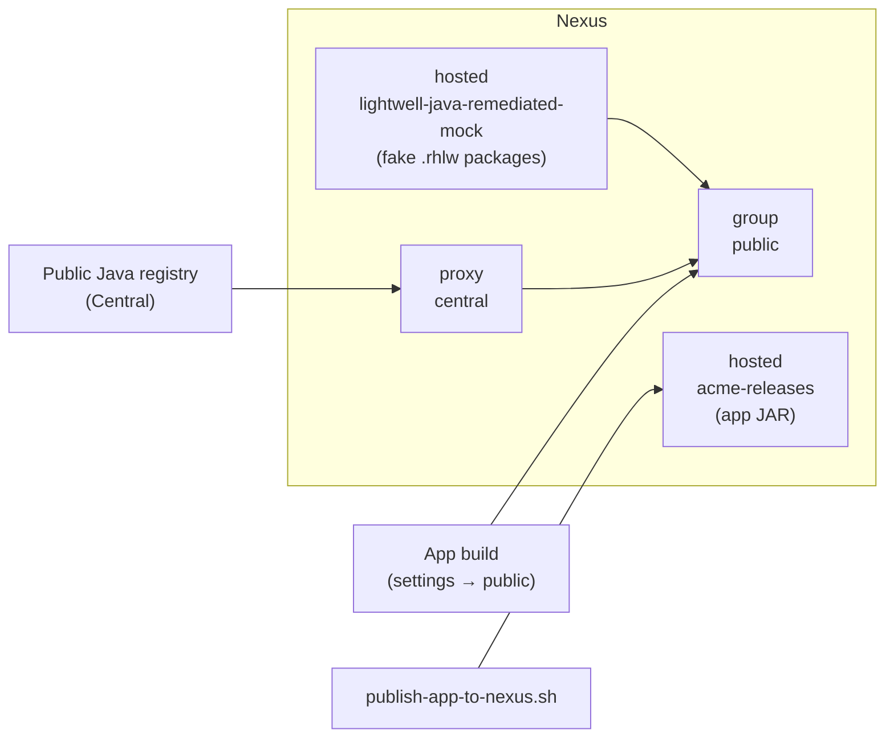
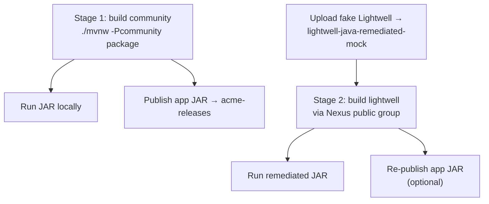

# lightwell_app

**ACME Order Hub** — demo for [Red Hat Lightwell Network](https://www.redhat.com/en/technologies/cloud/lightwell-network). Show a normal Spring Boot build first, then Stage 2: resolve a **fake Lightwell** Spring version (`5.3.18.rhlw-00010`) through **Sonatype Nexus**.

## Table of contents

1. [Prerequisites](#prerequisites)
2. [How the pieces fit](#how-the-pieces-fit)
3. [Stage 1 — Build the app normally](#stage-1--build-the-app-normally)
4. [Already have Nexus?](#already-have-nexus)
5. [Stage 2 — Lightwell through Nexus (fake package)](#stage-2--lightwell-through-nexus-fake-package)
6. [Optional: provision Nexus with Ansible](#optional-provision-nexus-with-ansible)
7. [Story libraries](#story-libraries)
8. [Docs](#docs)

## Prerequisites

| Need | Stage 1 | Stage 2 / publish |
|------|---------|-------------------|
| JDK 11 | yes | yes |
| Project build wrapper (`./mvnw`) | yes | yes |
| Sonatype Nexus (existing or Ansible) | no | yes |
| Nexus admin password | no | yes |

## How the pieces fit

**Nexus layout** — one proxy, two hosted locals, one group builds use:



**Demo flow** — normal build first, then Lightwell via Nexus, then publish when you want:



Four repos, three jobs: **proxy** (`central`) for community packages, **hosted** for your stuff (`lightwell-…-mock` + `acme-releases`), **group** (`public`) so builds hit one URL (Lightwell first, then Central).

## Stage 1 — Build the app normally

Community Spring Framework `5.3.18` from public Central. No Nexus required.

```bash
./scripts/cve-status.sh community
./mvnw -Pcommunity package
java -jar target/lightwell-app-1.0.0-SNAPSHOT.jar
```

Open http://localhost:8080

## Already have Nexus?

Use this path when Nexus is already running. You do **not** need Ansible provisioning.

### A. Create repositories (Nexus UI)

Admin → **Repositories** → **Create repository**.

In the create dialog, pick the Java package recipe Nexus labels **maven2** (that is only the JAR layout name in Nexus — you are not installing a build tool). Then choose type:

| Name | Type | Notes |
|------|------|--------|
| `central` | **proxy** | Remote URL for the public Java registry (Central): `https://repo1.maven.org/maven2/` — that path is Central’s official address, not a build-tool install |
| `lightwell-java-remediated-mock` | **hosted** | Version policy: Release; write policy: Allow |
| `acme-releases` | **hosted** | Holds the ACME Order Hub JAR |
| `public` | **group** | Members (order matters): `lightwell-java-remediated-mock`, then `central` |

Skip any row that already exists. If your Nexus already uses different names, keep them and override in scripts / settings below.

### B. Publish the app JAR into Nexus

```bash
./mvnw -Pcommunity package

export NEXUS_URL='http://<your-nexus-host>:8081'
export NEXUS_USER='admin'
export NEXUS_PASSWORD='...'
export NEXUS_REPO='acme-releases'   # optional; this is the default

./scripts/publish-app-to-nexus.sh
```

Browse: `http://<nexus-host>:8081` → **Browse** → `acme-releases` → `com/acme/lightwell-app`.

### C. Point builds at Nexus (optional for Stage 1)

```bash
cp maven/settings-nexus.xml.example maven/settings-nexus.xml
# Set <url> to http://<nexus-host>:8081/repository/public/
# Set <password> to your Nexus admin (or deploy user) password
```

Then:

```bash
./mvnw -Pcommunity -s maven/settings-nexus.xml package
```

## Stage 2 — Lightwell through Nexus (fake package)

Demo simulation: republish Central Spring `5.3.18` jars as `5.3.18.rhlw-00010` into the Nexus **hosted** mock repo. Same idea as real Lightwell, without packages.redhat.com.

### 1. Stage and upload the fake Lightwell artifacts

```bash
./scripts/build-mock-lightwell-repo.sh

export NEXUS_URL='http://<your-nexus-host>:8081'
export NEXUS_USER='admin'
export NEXUS_PASSWORD='...'
# default repo: lightwell-java-remediated-mock
./scripts/upload-mock-to-nexus.sh
```

Confirm in Nexus **Browse** → `lightwell-java-remediated-mock` → `org/springframework/.../5.3.18.rhlw-00010/`.

### 2. Build with the Lightwell profile (resolves via Nexus)

Requires `maven/settings-nexus.xml` from [Already have Nexus? §C](#c-point-builds-at-nexus-optional-for-stage-1).

```bash
./scripts/cve-status.sh lightwell
./mvnw -Plightwell -s maven/settings-nexus.xml -U -DskipTests package
java -jar target/lightwell-app-1.0.0-SNAPSHOT.jar
```

Only the Spring version property changes (`5.3.18` → `5.3.18.rhlw-00010`). Application code is unchanged.

### 3. Re-publish the remediated build (optional)

```bash
NEXUS_REPO=acme-releases ./scripts/publish-app-to-nexus.sh
```

## Optional: provision Nexus with Ansible

If you do **not** already have Nexus:

```bash
cd ansible
ansible-galaxy collection install -r requirements.yml
cp inventory/hosts.example.yml inventory/hosts.yml
# Edit nexus host IP / SSH user
ansible-vault create inventory/group_vars/nexus/vault.yml
# vault.yml → nexus_admin_password: <secure-password>

ansible-playbook -i inventory/hosts.yml playbooks/provision_nexus.yml
```

Creates Podman Nexus, the repo layout above (except `acme-releases` — create that in UI or extend the role), and uploads the fake Lightwell artifacts.

### Real Lightwell proxy (later)

When you have Red Hat credentials for `packages.redhat.com`:

```yaml
configure_lightwell_proxy: true
lightwell_repo_user: <service-account>
lightwell_repo_token: <token>
```

Store those in vault; Nexus holds them on the proxy remote — not on developer laptops.

## Story libraries

| Library | Stage 1 (`community`) | Stage 2 (`lightwell` + Nexus mock) |
|---------|----------------------|-------------------------------------|
| Spring Framework | `5.3.18` | `5.3.18.rhlw-00010` (fake hosted) |
| Jackson Databind | `2.13.4.2` | unchanged |
| Apache Commons Text | `1.9` | unchanged |

## Docs

- [docs/nexus.md](docs/nexus.md) — repo layout, existing Nexus, variables
- [docs/maven.md](docs/maven.md) — build profiles and wrapper
- [ansible/README.md](ansible/README.md) — Ansible provision details
